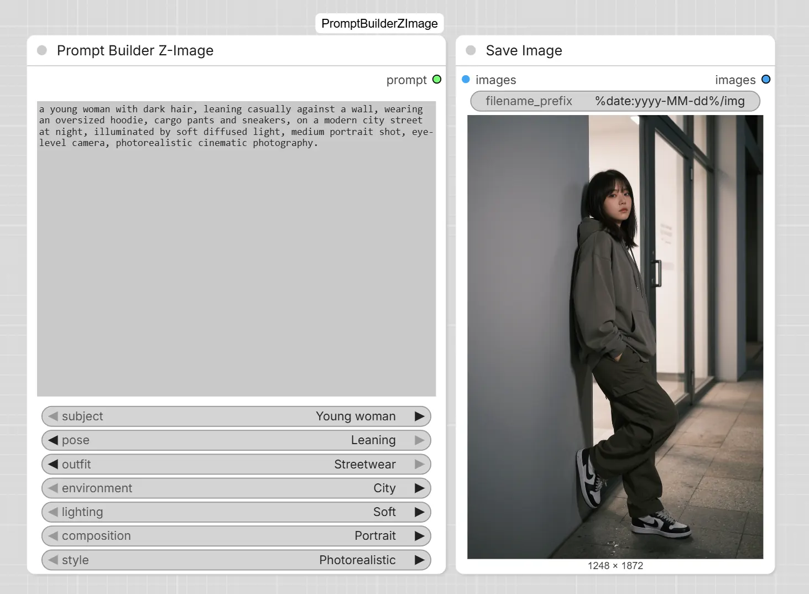

# ComfyUI-PromptBuilderZImage

A simple and intuitive ComfyUI node for building natural language prompts for Z-Image Turbo models. Select categories, combine components, and generate ready-to-use prompts in seconds.



## Features

- **Natural language prompt construction** - build prompts using descriptive categories
- **7 customizable categories** - subject, pose, outfit, environment, lighting, composition, and style
- **Automatic prompt assembly** - combines all parts into a coherent sentence
- **Live preview** - see your prompt update in real-time
- **Customizable** - edit `presets.json` to add your own entries to any category

## Inputs

| Parameter | Description |
|-----------|-------------|
| `subject` | Main subject description |
| `pose` | Body position and posture |
| `outfit` | Clothing and accessories |
| `environment` | Environment and setting |
| `lighting` | Lighting style and mood |
| `composition` | Shot composition and framing |
| `style` | Artistic or photographic style |

## Outputs

| Output | Type | Description |
|--------|------|-------------|
| `prompt` | STRING | Generated natural language prompt |

## How It Works

### Prompt Assembly Order

1. **Subject** - main character or subject description
2. **Pose** - body position and posture
3. **Outfit** - clothing and accessories
4. **Environment** - environment and setting
5. **Lighting** - lighting style and mood
6. **Composition** - shot composition and framing
7. **Style** - artistic or photographic style

### Example

If you select:
- **Subject**: "a young woman with dark hair"
- **Pose**: "standing naturally and looking at the camera"
- **Outfit**: "wearing a black leather jacket, white shirt and jeans"
- **Environment**: "on a modern city street at night"
- **Lighting**: "lit by dramatic cinematic lighting"
- **Composition**: "medium portrait shot, eye-level camera"
- **Style**: "photorealistic cinematic photography"

The resulting prompt will be:

> "a young woman with dark hair, standing naturally and looking at the camera, wearing a black leather jacket, white shirt and jeans, on a modern city street at night, lit by dramatic cinematic lighting, medium portrait shot, eye-level camera, photorealistic cinematic photography."

### Installation

```bash
git clone https://github.com/RokuZero/ComfyUI-PromptBuilderZImage.git
